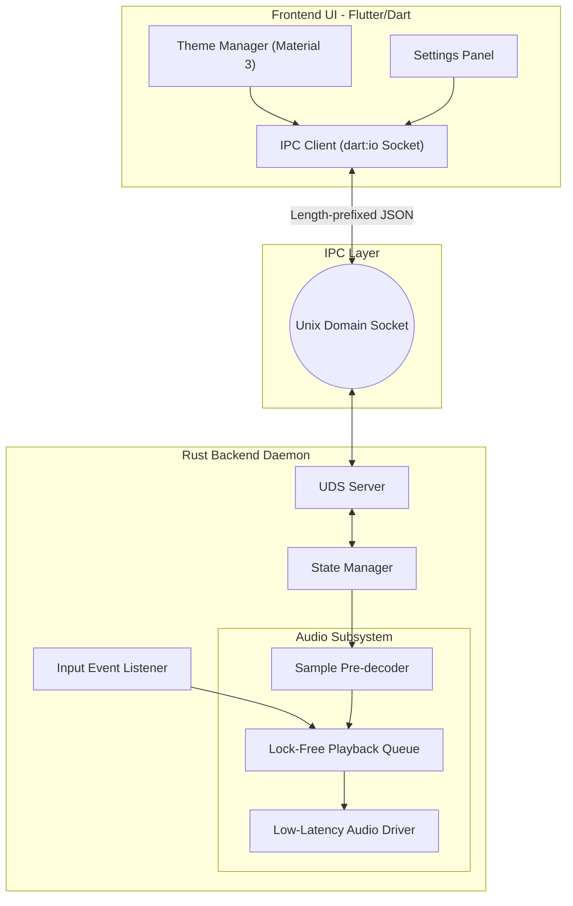

# Keyra Architecture & Implementation Plan

## 1. Executive Summary

**Project Keyra** is a high-performance, premium Linux desktop application designed to succeed the legacy "Klickity" codebase. It provides an ultra-low latency, responsive, and robust audio-feedback experience (e.g., mechanical keyboard simulation). The architecture is split into a **Flutter Linux Desktop** frontend and a highly optimized system-level Rust daemon.

**Core Objectives:**
- **Zero-Popping, Sub-10ms Audio Latency:** Ensuring playback is instantaneous under high typing loads.
- **Hardened IPC:** Reliable, high-throughput Unix Domain Socket (UDS) communication.
- **Modern UI:** Premium, reactive Linux-native UI built with Flutter/Dart (Skia-rendered, no WebView).
- **Resilience:** Multi-threaded Rust backend designed to never block the main audio or input threads.

---

## 2. Architecture Analysis & High-Level Design

The architecture follows a strictly decoupled **Client-Server (Daemon)** model running locally on the user's machine.

### 2.1 Component Breakdown
1. **Frontend UI (The Client):**
   - Flutter Linux Desktop (Dart).
   - Responsible for configuration, theme management, and system status display.
   - Communicates directly with the daemon via Unix Domain Socket (no intermediary).
2. **Backend Daemon (The Server):**
   - Written in Rust.
   - Runs as a persistent background process.
   - Captures system-wide input events.
   - Manages the lock-free audio engine and state.
3. **IPC Bridge:**
   - Unix Domain Sockets (UDS).
   - Bidirectional message passing (JSON or lightweight binary like MessagePack).

### 2.2 System Diagram (Mermaid)

---

## 3. Subsystem Planning

### 3.1 Audio Engine Subsystem (Rust)
To achieve sub-10ms latency and eliminate runtime popping:
- **Pre-decoding:** All audio assets (e.g., `.wav`, `.mp3`) must be fully decoded into raw PCM format in memory (`Vec<f32>`) during startup or theme switching.
- **Lock-Free Playback:** The audio playback thread must not acquire mutexes. Use lock-free data structures (e.g., `crossbeam` queues or `ringbuf`) to pass play commands from the input listener to the audio driver.
- **Driver:** Use `cpal` for cross-platform, low-latency audio output, directly interacting with ALSA or PulseAudio/PipeWire.

### 3.2 Input Handling Subsystem
- **Global Hooks:** Efficient capture of raw input events (e.g., using `evdev` or X11/Wayland hooks) to trigger audio playback without waiting for OS-level UI event propagation.
- **Debouncing/Throttling:** Smart handling of rapid inputs to prevent audio engine saturation.

### 3.3 IPC & State Management Subsystem
- **Protocol:** Define a strict schema for IPC messages:
  - `Command`: UI -> Daemon (e.g., `SetVolume(f32)`, `ChangeTheme(String)`).
  - `Event`: Daemon -> UI (e.g., `StateUpdated(State)`, `Error(String)`).
- **Single Source of Truth:** The Rust daemon holds the master configuration state. The UI acts as a pure function of this state.

---

## 4. Implementation Sequencing (XP Planning)

The implementation is broken into 5 incremental phases to ensure stability at every step.

### Phase 1: Foundation & IPC Scaffolding
- Initialize Rust daemon project and React frontend.
- Implement the basic UDS server in Rust and the client in the frontend.
- Establish the message schema and verify bidirectional ping/pong communication.

### Phase 2: Core Daemon & Pre-decoding Engine
- Implement the audio pre-decoder in Rust.
- Set up `cpal` and verify basic playback of pre-decoded memory buffers.
- Create unit tests for audio decoding to ensure no runtime allocation.

### Phase 3: Integration of Input & Audio
- Implement system-wide key interception.
- Connect the input listener to the lock-free audio playback queue.
- **Milestone:** Daemon can play sounds on keypresses independently with sub-10ms latency.

### Phase 4: UI Development & State Sync
- Build the premium React/TS interface.
- Implement the configuration state manager in the daemon.
- Connect UI controls to IPC commands (volume sliders, theme selectors).
- Ensure the UI reflects daemon state immediately.

### Phase 5: Hardening, Polish, & Optimization
- Address edge cases: rapid theme switching, audio device disconnection.
- Optimize memory usage of pre-decoded audio buffers.
- Package for Linux distribution (systemd service, desktop entry).

### Phase 6: Distribution, Ecosystem & Advanced Features
- **Packaging:** Create PKGBUILD for AUR and setup generic distribution (AppImage/Flatpak).
- **Migration:** Develop Klickity migration tool to port old themes and configs.
- **Soundpacks:** Add support for importing `.zip` soundpacks via the Flutter UI.
- **Per-App Profiles:** Enhance audio engine to support application-specific sound profiles.

### Phase 7: Sound Refinement & Out-of-the-Box Experience
- **Bundled Packs:** Include a high-quality default sound pack in the installation.
- **Audio Normalization:** Implement peak normalization to ensure consistent volume across packs.
- **Dynamic Variations:** Add optional pitch jitter and velocity-based volume scaling for more realistic feedback.
- **Auto-Provisioning:** Daemon should automatically download or extract a base pack if none is found.

### Phase 8: Advanced Audio Effects & Mixing
- **Low-Latency Filters:** Add optional low-pass/high-pass filters per pack.
- **Reverb/Spatialization:** Implement a lightweight reverb engine for "room" feel.
- **Multi-Output Support:** Allow routing audio to specific devices or virtual sinks.

### Phase 9: Community & Extension Ecosystem
- **Cloud Sync:** Sync configurations and favorite packs across devices.
- **Pack Store:** Browsing and one-click installation of community sound packs.
- **Plugin System:** Allow developers to write custom audio processors or input hooks.

### Phase 10: Performance Hardening & Final Polish
- **Kernel-Level Input (Optional):** Explore `uinput` for even lower latency.
- **Resource Profiling:** Optimize memory and CPU for low-end hardware.
- **Global Release:** Final packaging, website, and documentation for public launch.

---

## 5. Migration Strategy (From Klickity to Keyra)

- **Asset Compatibility:** Ensure Keyra can read and parse legacy Klickity theme folders to prevent breaking the user's existing configurations.
- **Parallel Run:** Allow Keyra to be installed alongside Klickity during the beta phase.
- **Configuration Porting:** Write a one-time migration script in the daemon that detects `~/.config/klickity` and copies relevant settings to `~/.config/keyra`.

---

## 6. Risk Analysis & Mitigation

| Risk | Impact | Likelihood | Mitigation Strategy |
| :--- | :--- | :--- | :--- |
| **Audio Popping / Stuttering** | High | Medium | Enforce strict pre-decoding. No heap allocations in the audio thread. Use ring buffers. |
| **High CPU Usage on Idle** | Medium | Low | Ensure event loops block efficiently (e.g., `epoll`) rather than spin-locking. |
| **UDS Socket Deadlocks** | High | Medium | Set non-blocking flags and timeouts on IPC sockets. Implement a heartbeat mechanism. |
| **Wayland Compatibility** | High | High | Use appropriate Linux input subsystems (`evdev` or specific Wayland compositors protocols) since global keylogging is restricted under Wayland. |

---

## 7. Optimization Strategy

- **Memory Layout:** Store PCM data continuously in memory. Use `Arc<[f32]>` for lock-free, zero-copy sharing of audio data across threads.
- **Thread Prioritization:** Request real-time priority (e.g., `SCHED_RR` or `SCHED_FIFO`) for the audio playback thread if permissions allow, or use `RTKit`.
- **Batching IPC:** If the daemon needs to send high-frequency events (e.g., volume meters), batch them into a single payload or cap the emit rate to 60fps to prevent overloading the React UI.

---

## 8. Technical Recommendations

1. **Rust Ecosystem Choices:**
   - `cpal` for low-level audio.
   - `hound` or `symphonia` for fast, allocation-free audio decoding at startup.
   - `crossbeam` for lock-free queues.
   - `serde` / `serde_json` for IPC serialization.
2. **Frontend Architecture (Flutter/Dart):**
   - Use `Provider` (ChangeNotifier) for managing the synchronized daemon state on the client side.
   - Direct UDS connection via `dart:io` `RawSocket` — no WebView or intermediary layer.
   - Auto-reconnect with exponential backoff in case the daemon restarts.
3. **Development Tooling:**
   - Setup a unified runner (e.g., `just` or `make`) to launch both the daemon and UI simultaneously during local development.
   - Use `flutter run -d linux` for hot reload during development.
