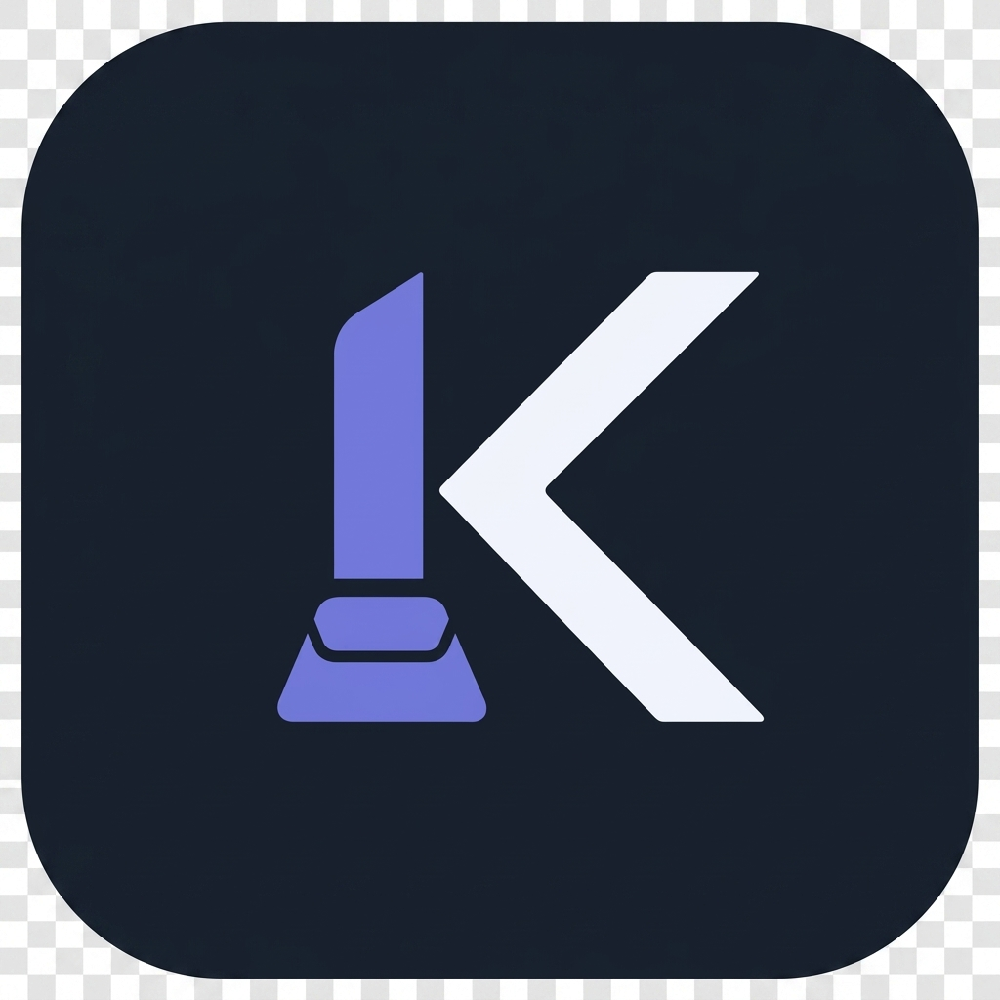
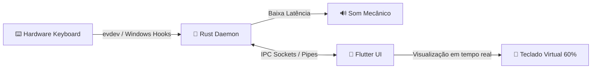

# ⌨️ Keyra - Mechanical Keyboard Visualizer & Sound Generator

<div align="center">
  
  
  <p align="center">
    <strong>Uma experiência premium de customização visual e sonora para o seu teclado.</strong>
  </p>
  
  <p align="center">
    
    
    
    
  </p>
</div>

---

## 🌟 Sobre o Keyra

O **Keyra** é uma ferramenta de customização de teclado desktop projetada com estética moderna inspirada no macOS (efeitos blur, glassmorphism e animações fluidas). Ele é composto por dois módulos principais focados em altíssimo desempenho e baixa latência:

1. **Rust Daemon (`keyra-daemon`)**: Um serviço robusto em Rust executado em segundo plano. Ele se conecta aos inputs de hardware de baixíssimo nível (usando `evdev` no Linux) para capturar o pressionamento de teclas em tempo real com latência zero e reproduzir os samples de áudio instantaneamente.
2. **Flutter UI (`keyra-flutter`)**: Uma interface gráfica moderna, responsiva e elegante que permite gerenciar pacotes de som (Sound Packs), alterar o volume, monitorar a latência do daemon e visualizar as teclas ativas em um teclado mecânico virtual 60% com efeitos de ondas de choque dinâmicas.

---

## 🏗️ Arquitetura do Sistema

A comunicação entre a UI do Flutter e o Daemon em Rust é feita de forma extremamente eficiente através de **Unix Domain Sockets (IPC)** no Linux e **Named Pipes** no Windows.



---

## 🚀 Como Executar e Compilar em Cada Plataforma

Abaixo estão os guias passo a passo para configurar e buildar o Keyra localmente nas plataformas suportadas.

---

### 🐧 1. Guia para Linux

#### 🔹 Pré-requisitos do Sistema
Antes de compilar, você precisa instalar os pacotes de desenvolvimento do sistema para suportar a UI gráfica do Flutter (GTK) e o backend de áudio e input em Rust:

```bash
sudo apt update
sudo apt install -y libgtk-3-dev libasound2-dev pkg-config libx11-dev libxi-dev libxtst-dev build-essential
```

#### 🔹 Compilar o Daemon (Rust)
1. Navegue até a pasta do daemon:
   ```bash
   cd keyra-daemon
   ```
2. Compile a versão de produção (Release):
   ```bash
   cargo build --release
   ```
3. O executável binário estará disponível em `target/release/keyra-daemon`.

#### 🔹 Compilar a Interface Gráfica (Flutter)
1. Certifique-se de que o Flutter SDK está instalado e configurado no seu `PATH`.
2. Navegue até a pasta da interface:
   ```bash
   cd keyra-flutter
   ```
3. Baixe as dependências do pubspec:
   ```bash
   flutter pub get
   ```
4. Compile a aplicação para Linux:
   ```bash
   flutter build linux --release
   ```
5. A aplicação compilada estará localizada em `build/linux/x64/release/bundle/keyra-flutter`.

#### 🔹 Empacotamento Automatizado (Debian e AppImage)
Nós criamos scripts de empacotamento simplificados na pasta `packaging/` para gerar os instaladores oficiais do Linux:

```bash
# Para gerar o instalador .deb (Debian, Ubuntu, Mint):
./packaging/build_deb.sh

# Para gerar o pacote portátil .AppImage (Qualquer distribuição Linux):
./packaging/build_appimage.sh
```
Os arquivos gerados estarão localizados diretamente dentro da pasta `packaging/`.

---

### 🪟 2. Guia para Windows

#### 🔹 Pré-requisitos do Sistema
1. Instale o [Visual Studio Build Tools](https://visualstudio.microsoft.com/visual-cpp-build-tools/) com suporte a C++ para habilitar a compilação do Rust no Windows.
2. Certifique-se de ter o **Rustup** (MSVC toolchain) e o **Flutter SDK** instalados e configurados nas suas variáveis de ambiente.

#### 🔹 Compilar o Daemon (Rust)
1. Abra o terminal (PowerShell ou CMD) na pasta do daemon:
   ```powershell
   cd keyra-daemon
   ```
2. Compile a versão de produção:
   ```powershell
   cargo build --release
   ```
3. O executável portátil estará em `target/release/keyra-daemon.exe`.

#### 🔹 Compilar a Interface Gráfica (Flutter)
1. Navegue até a pasta da interface:
   ```powershell
   cd keyra-flutter
   ```
2. Instale as dependências:
   ```powershell
   flutter pub get
   ```
3. Compile a aplicação para Windows:
   ```powershell
   flutter build windows --release
   ```
4. Os arquivos finais da UI do Windows estarão em `build/windows/x64/release/runner/`.

#### 🔹 Montando o Pacote de Distribuição no Windows
No Windows, para que a interface gráfica localize o Daemon em Rust automaticamente, ambos devem estar no mesmo diretório:

1. Crie uma pasta de distribuição (ex: `keyra-windows/`).
2. Copie todo o conteúdo de `keyra-flutter/build/windows/x64/release/runner/` para dentro dela.
3. Copie o arquivo `keyra-daemon.exe` de `keyra-daemon/target/release/` para a mesma pasta.
4. Agora você pode executar o `keyra-flutter.exe` normalmente!

---

## 🎶 Como Adicionar Sound Packs Customizados

O Keyra suporta pacotes de som estruturados no padrão Mechvibes/Keyra. Cada pacote de som é composto por uma pasta contendo os arquivos de áudio e um arquivo de configuração central `config.json`.

Exemplo de estrutura de um Sound Pack:
```text
meu-sound-pack/
├── config.json
├── keypress.wav     (ou vários arquivos individuais de som)
└── spacebar.wav
```

### Formato do arquivo `config.json`:
```json
{
  "name": "Meu Sound Pack Premium",
  "id": "meu-sound-pack-id",
  "defines": {
    "1": "keypress.wav",
    "2": "keypress.wav",
    "57": "spacebar.wav"
  }
}
```
*Os números correspondem aos códigos de tecla do teclado (Keycodes).*

Os pacotes de som devem ser colocados no diretório de dados local do usuário (por exemplo, `~/.local/share/keyra/packs/` no Linux).

---

## 🛠️ Automação de Integração Contínua (CI/CD)

O projeto possui um workflow automático no GitHub Actions configurado no arquivo `.github/workflows/release.yml`. Toda vez que uma tag no formato `v*.*.*` (ex: `v0.1.0`) é criada e enviada para o GitHub, o pipeline:

1. Cria ambientes virtuais para Linux e Windows.
2. Baixa dependências, compila o Daemon em Rust e a UI em Flutter.
3. Cria pacotes `.deb`, `.AppImage` e `.zip` portáteis.
4. Gera e publica uma nova **GitHub Release** oficial contendo os instaladores gerados automaticamente em segundo plano.

---

## 📝 Licença

Este projeto é distribuído sob a licença MIT. Veja o arquivo `LICENSE` para mais detalhes.
